# Drowning Prevention Kit
### Acoustic Transmitter and Hydrophone Receiver


---

## Table of Contents

- [Overview](#overview)
- [Objectives](#objectives)
- [System Architecture](#system-architecture)
- [How It Works - Working Principle](#how-it-works---working-principle)
- [Hardware Components](#hardware-components)
- [Circuit Design and Connections](#circuit-design-and-connections)
- [Receiver Software Design](#receiver-software-design)
- [Flutter Mobile Application](#flutter-mobile-application)
- [Usage Guide - How to Use](#usage-guide---how-to-use)
- [Experimental Results](#experimental-results)
- [Advantages](#advantages)
- [Limitations](#limitations)
- [Conclusion](#conclusion)
- [Author](#author)

---

## Overview

This project presents a **low-cost, IoT-based underwater drowning detection and rescue alert system**. When a swimmer's wearable transmitter unit detects a likely emergency, it emits a **1500 Hz acoustic distress tone** underwater. A poolside **hydrophone receiver station** captures this tone, verifies it against false positives, and raises an immediate alarm for lifeguards or caregivers through:

- **Local LED and buzzer alarm** at the receiver station
- **Flutter mobile application** with full-screen emergency alerts, siren, and vibration

The system consists of **three cooperating units**:

1. **Wearable Acoustic Transmitter** - monitors vital signs and emits underwater distress tone
2. **Hydrophone Receiver Station** - detects and verifies the tone using Goertzel algorithm
3. **Flutter Mobile Application** - displays alerts and maintains incident history

Together, they form a **closed acoustic-to-digital alert pipeline** from underwater tone detection to on-screen emergency notification.

[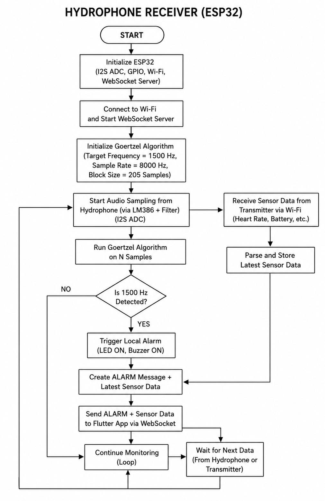](diagrams/esp32_receiver_flowchart.png)

---

## Objectives

The primary objectives of this project are:

1. **Design and construct** a low-cost hydrophone receiver capable of reliably detecting a 1500 Hz underwater acoustic tone in the presence of ambient pool noise.
2. **Implement** a Goertzel-algorithm-based single-frequency detector on the ESP32 for efficient, low-latency tone recognition suited to a resource-constrained microcontroller.
3. **Design** a signal-conditioning chain (amplification, band-pass filtering, and biasing) that safely interfaces the analog hydrophone signal with the ESP32 ADC.
4. **Establish** a Wi-Fi Access Point and WebSocket server on the ESP32 for real-time, bidirectional JSON communication with the mobile application.
5. **Develop** a Flutter mobile application capable of live sensor monitoring, connection-status tracking, and an emergency alert interface with audible and vibratory notification.
6. **Integrate** the receiver and mobile application into a single coherent alert workflow, from underwater tone reception to on-screen emergency notification.

---

## System Architecture

The complete system operates across three cooperating units:

```
[Wearable Transmitter] ---(1500 Hz acoustic tone)---> [Hydrophone Receiver (ESP32)]
                                                              |
                                                     (WebSocket JSON)
                                                              |
                                                      [Flutter Mobile App]
                                                    (Alert / Siren / Vibration)
```

### Why Acoustic Over RF?

The wearable transmitter continuously evaluates heart rate, water-contact, and motion data on the swimmer's body. When an emergency condition is confirmed, it drives a submerged piezo transmitter to emit a 1500 Hz acoustic tone underwater. This **acoustic-first approach is a deliberate design decision**:

- **RF signals** (such as NRF24L01) attenuate to **near-zero within centimetres of submersion**, making underwater radio unreliable.
- **Acoustic energy** propagates efficiently through water, providing a reliable communication channel.

### Receiver Station

The receiver station, moored at a fixed poolside location, listens continuously for this tone using its hydrophone front end. Upon a confirmed detection, the ESP32 receiver:

1. Raises a **local LED and buzzer alarm**
2. Pushes a **JSON alert** over a self-hosted Wi-Fi Access Point to the Flutter application
3. The Flutter app displays the emergency alert, plays a siren, and vibrates the caregiver's phone

The transmitter also reports live BPM, water, and motion telemetry over Wi-Fi, which the receiver forwards to the Flutter dashboard for continuous monitoring even in the absence of an emergency.

---

## Hardware Components

### Complete Component List

| # | Component | Specification | Quantity | Function |
| - | --- | --- | - | --- |
| 1 | ESP32 DevKit V1 | Dual-core, Wi-Fi + BLE, 12-bit ADC | 1 | Signal sampling, Goertzel detection, WebSocket server |
| 2 | DIY Piezo Hydrophone | 35 mm piezo disc, waterproofed | 1 | Underwater acoustic-to-electrical transduction |
| 3 | LM386 | Audio power amplifier IC | 1 | Pre-amplification of raw piezo signal (20-200x gain) |
| 4 | TL082 | Dual JFET op-amp IC | 1 | Active band-pass (MFB) filtering around 1500 Hz |
| 5 | Red LED | 5 mm, standard | 1 | Visual alarm indicator |
| 6 | Active Buzzer | 5 V, self-oscillating | 1 | Audible local alarm |
| 7 | 9 V Battery | Alkaline or rechargeable | 1 | Analog front-end power supply |
| 8 | Resistors | 10 kOhm (x4), 200 kOhm (x1) | 5 | Voltage dividers, filter feedback, bias network |
| 9 | Capacitors | 10 uF (x3), 470 uF (x1), 3.3 nF (x2) | 6 | AC coupling, virtual ground, filter tuning |
| 10 | Breadboard + Jumper Wires | Standard | 1 set | Circuit prototyping |

### Detailed Component Overview

#### ESP32 DevKit V1
The heart of the receiver station. The ESP32 is a dual-core microcontroller with built-in Wi-Fi and a 12-bit ADC (0-4095 range). It runs the Goertzel algorithm for real-time frequency detection, hosts a Wi-Fi Access Point, runs a WebSocket server, and drives the LED/buzzer alarm outputs. Key specifications:
- Dual-core Xtensa LX6 processor at 240 MHz
- Built-in Wi-Fi 802.11 b/g/n
- 12-bit SAR ADC (up to 18 channels)
- GPIO pins for digital output (LED, buzzer)
- ADC-capable pin (GPIO32) for hydrophone input

#### DIY Piezo Hydrophone
A bare 35 mm piezo disc, waterproofed and submerged near the pool floor. It generates a low-amplitude AC voltage in response to incident acoustic pressure. The piezo acts as a transducer, converting underwater sound waves into electrical signals. For waterproofing, the disc is sealed with silicone or epoxy, leaving only the active face exposed to water.

#### LM386 Audio Amplifier
A low-voltage audio power amplifier IC configured for a nominal gain of 20-200x. It raises the microvolt-to-millivolt-level piezo output to an amplitude suitable for further filtering. The amplifier output is AC-coupled through a 10 uF capacitor to remove any residual DC offset before entering the filter stage.

#### TL082 Dual Op-Amp
A dual JFET-input operational amplifier used to build the active band-pass filter. One half of the TL082 implements a Multiple Feedback (MFB) topology tuned to 1500 Hz using two 3.3 nF capacitors and 10 kOhm / 200 kOhm feedback resistors. The non-inverting input is tied to the virtual ground reference for single-supply operation.

#### Virtual Ground Network
Since the analog front end runs from a single 9 V rail, a mid-supply reference at approximately 4.5 V is generated using a resistive divider (10 kOhm + 10 kOhm) buffered by a 470 uF electrolytic capacitor. This biases the LM386 and TL082 stages so AC signals swing symmetrically without clipping.

#### Signal Conditioning Divider
A separate resistive divider (10 kOhm + 10 kOhm) referenced between the 3.3 V rail and true ground (0 V) centres the filtered AC signal at approximately 1.65 V, matching the ESP32 ADC midpoint. A 10 uF coupling capacitor removes DC from the filter output before the divider.

[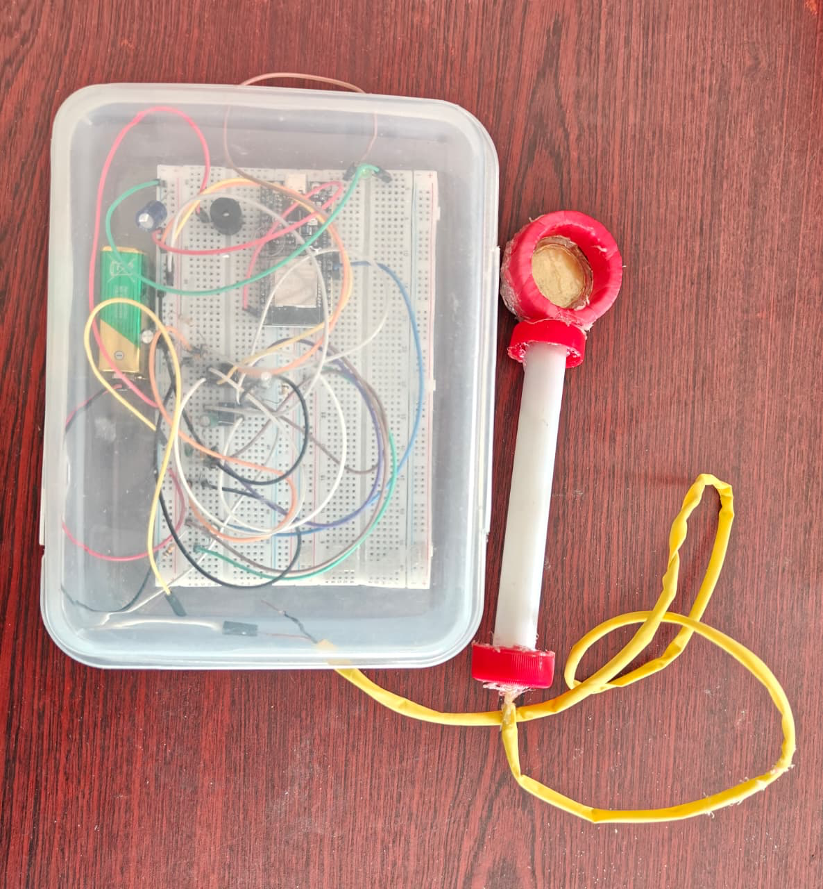](diagrams/receiver_with_hydrophone.jpg)

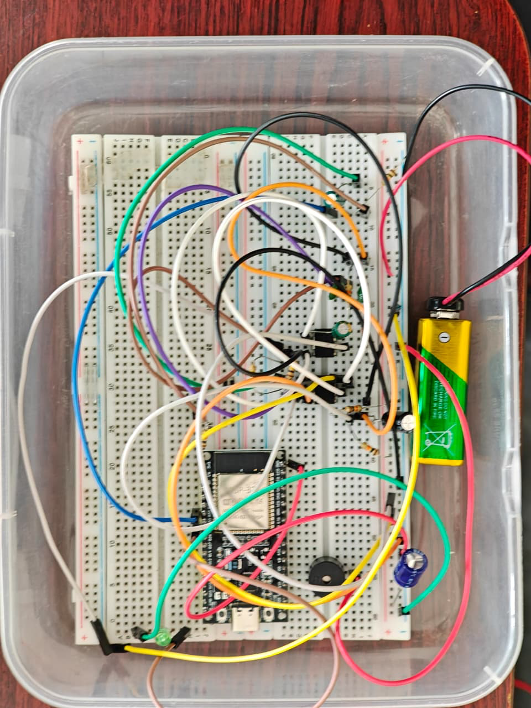

---

## Circuit Design and Connections

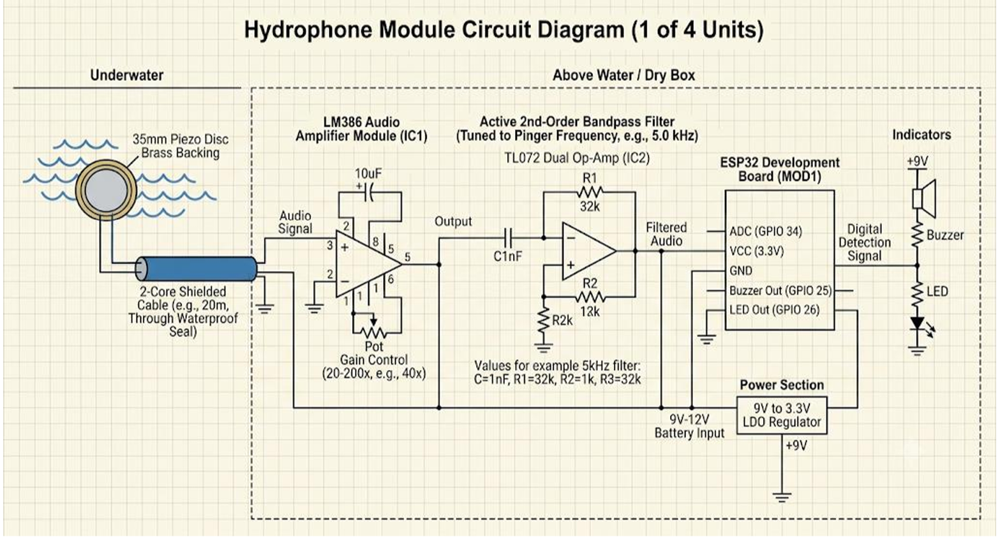

### Complete Signal Chain

```
[Hydrophone] --> [LM386 Amp] --> [TL082 Band-Pass Filter] --> [Bias Divider] --> [ESP32 ADC (GPIO32)]
                                                                                     |
                                                                              [ESP32 GPIO25] --> [Buzzer]
                                                                              [ESP32 GPIO2]  --> [LED]
```

### Stage-by-Stage Wiring

#### Stage 1: Power Supply and Virtual Ground

```
9V Battery (+) -----> LM386 VCC, TL082 VCC
9V Battery (-) -----> GND (common ground)

Virtual Ground (VGND = ~4.5V):
  9V ---[10k]---+---[10k]--- GND
                 |
                [470uF] (to GND, positive to junction)
                 |
               VGND (connect to LM386 pin 3, TL082 pin 3)
```

#### Stage 2: Hydrophone and LM386 Amplifier

```
Piezo Hydrophone:
  Piezo wire 1 -----> LM386 Input (+) via 10uF coupling cap
  Piezo wire 2 -----> GND

LM386 Connections:
  Pin 1 ----> GND (gain set to 20x by default)
  Pin 2 ----> Signal input (from piezo via cap)
  Pin 3 ----> GND (or VGND for bias)
  Pin 4 ----> GND
  Pin 5 ----> Output (to next stage via 10uF cap)
  Pin 6 ----> 9V VCC
  Pin 7 ----> Bypass cap to GND
  Pin 8 ----> GND (gain control)
```

#### Stage 3: TL082 Active Band-Pass Filter (MFB)

```
Signal from LM386 (via 10uF cap) ----> Filter input

TL082 (one half):
  Pin 1 ----> Output (feedback path)
  Pin 2 ----> Inverting input (summing node)
  Pin 3 ----> VGND (non-inverting, bias reference)
  Pin 4 ----> GND (or negative rail)
  Pin 8 ----> 9V VCC

Feedback network:
  Input ---[10k]--- Pin 2
  Pin 2 ---[200k]--- Pin 1 (feedback resistor)
  Input ---[3.3nF]--- Pin 2 (input capacitor)
  Pin 1 ---[3.3nF]--- Pin 2 (feedback capacitor)
  Pin 3 ----> VGND

Centre frequency: ~1500 Hz
```

#### Stage 4: ESP32 Signal Conditioning

```
Filter output (Pin 1) ---[10uF]--- junction
                                     |
                               +---[10k]--- 3.3V
                               |
                               +---[10k]--- GND (true GND, not VGND)
                               |
                            ESP32 GPIO32 (ADC input)

NOTE: The 3.3V and GND here are from the ESP32 board,
NOT from the 9V analog supply. This scales the signal
into the 0-3.3V ADC range (bias at 1.65V midpoint).
```

#### Stage 5: LED and Buzzer Outputs

```
ESP32 GPIO2  ---[220 ohm]--- LED (+) --- LED (-) --- GND
ESP32 GPIO25 ---[100 ohm]--- Buzzer (+) --- Buzzer (-) --- GND

Both are active HIGH: firmware sets pin HIGH to activate.
```

### Pin Reference Table

| ESP32 Pin | Connected To | Direction | Notes |
| - | - | - | - |
| GPIO32 | Hydrophone signal | Input (ADC) | 12-bit ADC, 0-3.3V range |
| GPIO25 | Active Buzzer | Output | HIGH = buzzer ON |
| GPIO2 | Red LED | Output | HIGH = LED ON |
| 3.3V | Bias divider | Power | For signal conditioning only |
| GND | Common ground | Power | Shared with analog circuit GND |
| VIN | 9V battery | Power | Powers the analog front-end separately |

[](diagrams/esp32_receiver_flowchart.png)

---

## How It Works - Working Principle

### Step-by-Step Detection Process

**Step 1: Continuous Monitoring**
The hydrophone receiver station continuously samples the underwater acoustic environment via the piezo hydrophone. The conditioned analog signal is read by the ESP32 ADC at 6000 Hz, collecting 200 samples per analysis block.

**Step 2: Goertzel Frequency Detection**
Rather than computing a full FFT spectrum, the ESP32 uses the **Goertzel algorithm** to evaluate the signal energy at exactly **1500 Hz** - the distress tone frequency. This is computed in O(N) time with only two state variables, making it ideal for real-time detection on a microcontroller.

```
For each 200-sample block:
  1. Compute Goertzel coefficient: coeff = 2 * cos(2*pi*k/N)
  2. Run IIR filter on all 200 samples
  3. Compute magnitude at 1500 Hz bin
  4. Compare against threshold + reference frequency ratio
```

**Step 3: Signal Verification (Anti-False-Positive)**
A single high-magnitude reading is NOT treated as a confirmed detection. The firmware applies three verification layers:

1. **Amplitude Threshold** - magnitude must exceed 50.0 (configurable)
2. **Signal Ratio** - target/1500 Hz must be > 1.3x the reference/1000 Hz (rejects broadband noise)
3. **Confirmation Window** - must sustain >50% hit rate over a 2-second rolling window (rejects transient impacts)

**Step 4: Alarm Trigger**
On confirmed detection:
- Local **LED and buzzer activate** (blinking at 300ms intervals for 30 seconds)
- **WebSocket broadcasts** `"ALARM"` message to all connected Flutter clients
- Serial monitor logs detection details

**Step 5: Mobile Alert**
The Flutter app receives the ALARM message and:
- Switches to **full-screen red emergency display** with "DROWNING DETECTED"
- Plays a **loud siren** through the phone speaker
- **Vibrates** the phone with a distinct pattern
- Captures an **Emergency Clip** from the video buffer
- Logs the event in **Incident History**

**Step 6: Reset**
After 30 seconds (configurable), the alarm auto-stops. The caregiver can also manually stop it via the Flutter app or serial command (`"stop"` or `"reset"`).

### Detection Flow

```
[Hydrophone] --> [LM386 Amp] --> [1500Hz BPF] --> [ADC @ 6000Hz]
                                                      |
                                                 [Goertzel]
                                                      |
                                        [Magnitude > Threshold?]
                                           |              |
                                          YES            NO --> Continue
                                           |
                                [Ratio > 1.3x Reference?]
                                           |              |
                                          YES            NO --> Continue
                                           |
                               [Confirmation Window Met?]
                                           |              |
                                          YES            NO --> Continue
                                           |
                               [ALARM --> LED + Buzzer + WebSocket]
                                           |
                                    [Flutter Alert]
```

---

## Receiver Software Design

The receiver firmware is developed in **C++ using the Arduino framework** for ESP32.

### Goertzel Algorithm Implementation

```c
float goertzelMagnitude(int16_t *samples, int N, float targetFreq, float sampleRate) {
    float k = roundf((N * targetFreq) / sampleRate);
    float omega = (2.0 * PI * k) / N;
    float coeff = 2.0 * cos(omega);
    float s0 = 0, s1 = 0, s2 = 0;
    for (int n = 0; n < N; n++) {
        s0 = samples[n] + coeff * s1 - s2;
        s2 = s1;
        s1 = s0;
    }
    float real = s1 - s2 * cos(omega);
    float imag = s2 * sin(omega);
    return sqrt(real * real + imag * imag);
}
```

### Threshold and Consecutive-Detection Verification

```c
const float THRESHOLD = 4500.0;
const int CONFIRM_COUNT = 5;
int consecutiveHits = 0;

bool verifySignal(float magnitude) {
    if (magnitude > THRESHOLD) {
        consecutiveHits++;
    } else {
        consecutiveHits = 0;
    }
    return (consecutiveHits >= CONFIRM_COUNT);
}
```

### WebSocket Server Initialisation

```c
AsyncWebServer server(80);
AsyncWebSocket ws("/ws");

void setupWebSocket() {
    ws.onEvent(onWsEvent);
    server.addHandler(&ws);
    server.begin();
}

void onWsEvent(AsyncWebSocket *server, AsyncWebSocketClient *client,
               AwsEventType type, void *arg, uint8_t *data, size_t len) {
    if (type == WS_EVT_CONNECT) {
        Serial.printf("Flutter client connected: %u\\n", client->id());
    }
}
```

### JSON Alarm Message

```c
void sendAlarm() {
    StaticJsonDocument<128> doc;
    doc["type"] = "ALARM";
    doc["source"] = "hydrophone";
    doc["frequency"] = 1500;
    doc["timestamp"] = millis();

    String payload;
    serializeJson(doc, payload);
    ws.textAll(payload);

    digitalWrite(LED_PIN, HIGH);
    digitalWrite(BUZZER_PIN, HIGH);
}
```

### Complete Firmware Source

The full working ESP32 firmware is included in the code block below. This is the complete, tested source code:

```c
#include <WiFi.h>
#include <WebSocketsServer.h>
#include <math.h>

const char* ssid = "test";
const char* password = "1234567890";

WebSocketsServer webSocket(81);

const int HYDROPHONE_PIN = 32;
const int BUZZER_PIN = 25;
const int LED_PIN = 2;

const float SAMPLE_RATE_HZ = 6000.0;
const int N_SAMPLES = 200;
const float TARGET_FREQ_HZ = 1500.0;
const float REFERENCE_FREQ_HZ = 1000.0;

float GOERTZEL_THRESHOLD = 50.0;
float SIGNAL_RATIO_THRESHOLD = 1.3;

const int ADC_CENTER = 2048;
float coeffTarget;
float coeffReference;
uint16_t samplePeriodUs;

bool alarmActive = false;
unsigned long alarmStartTime = 0;
const unsigned long ALARM_DURATION_MS = 30000;
unsigned long lastBlinkTime = 0;
bool ledBlinkState = false;
const unsigned long BLINK_INTERVAL_MS = 300;

const unsigned long CONFIRM_DURATION_MS = 2000;
float REQUIRED_HIT_RATIO = 0.5f;
const int MAX_HISTORY_BLOCKS = 300;
bool detectionHistory[MAX_HISTORY_BLOCKS];
int historyIndex = 0;
int historyCount = 0;
int verifiedCount = 0;
int CONFIRM_WINDOW_BLOCKS;

void resetConfirmationWindow() {
    historyIndex = 0; historyCount = 0; verifiedCount = 0;
}

void stopAlarm() {
    digitalWrite(BUZZER_PIN, LOW);
    digitalWrite(LED_PIN, LOW);
    ledBlinkState = false;
    alarmActive = false;
    resetConfirmationWindow();
    webSocket.broadcastTXT("ALARM_STOPPED");
}

void webSocketEvent(uint8_t num, WStype_t type, uint8_t *payload, size_t length) {
    switch (type) {
        case WStype_CONNECTED:
            webSocket.sendTXT(num, "CONNECTED");
            break;
        case WStype_TEXT: {
            String msg = String((char*)payload).substring(0, length);
            msg.trim();
            if (msg == "STOP_ALARM") stopAlarm();
            break;
        }
        default: break;
    }
}

void triggerAlarm() {
    if (alarmActive) return;
    ledBlinkState = true;
    digitalWrite(BUZZER_PIN, HIGH);
    digitalWrite(LED_PIN, HIGH);
    lastBlinkTime = millis();
    alarmActive = true;
    alarmStartTime = millis();
    webSocket.broadcastTXT("ALARM");
}

void goertzelMagnitudes(float &targetMag, float &referenceMag) {
    float q1t=0,q2t=0,q1r=0,q2r=0;
    unsigned long nextSampleTime = micros();
    for (int i=0; i<N_SAMPLES; i++) {
        while ((long)(micros()-nextSampleTime)<0) {}
        nextSampleTime += samplePeriodUs;
        float sample = (float)(analogRead(HYDROPHONE_PIN)-ADC_CENTER);
        float q0t=coeffTarget*q1t-q2t+sample; q2t=q1t; q1t=q0t;
        float q0r=coeffReference*q1r-q2r+sample; q2r=q1r; q1r=q0r;
    }
    float pT=q1t*q1t+q2t*q2t-q1t*q2t*coeffTarget;
    targetMag=sqrtf(pT>0?pT:0)/(N_SAMPLES/2.0f);
    float pR=q1r*q1r+q2r*q2r-q1r*q2r*coeffReference;
    referenceMag=sqrtf(pR>0?pR:0)/(N_SAMPLES/2.0f);
}

bool isVerifiedSignal(float t, float r) {
    float ratio=t/(r+1.0f);
    return (t>GOERTZEL_THRESHOLD)&&(ratio>SIGNAL_RATIO_THRESHOLD);
}

void setup() {
    Serial.begin(115200);
    analogReadResolution(12);
    pinMode(BUZZER_PIN, OUTPUT);
    pinMode(LED_PIN, OUTPUT);
    WiFi.mode(WIFI_AP);
    WiFi.softAP(ssid, password);
    webSocket.begin();
    webSocket.onEvent(webSocketEvent);
    int kT=(int)(0.5+(N_SAMPLES*TARGET_FREQ_HZ)/SAMPLE_RATE_HZ);
    coeffTarget=2.0*cosf((2.0*PI*kT)/N_SAMPLES);
    int kR=(int)(0.5+(N_SAMPLES*REFERENCE_FREQ_HZ)/SAMPLE_RATE_HZ);
    coeffReference=2.0*cosf((2.0*PI*kR)/N_SAMPLES);
    samplePeriodUs=(uint16_t)(1000000.0/SAMPLE_RATE_HZ);
    float bDur=(N_SAMPLES/SAMPLE_RATE_HZ)*1000.0;
    CONFIRM_WINDOW_BLOCKS=(int)(0.5+(CONFIRM_DURATION_MS/bDur));
    if (CONFIRM_WINDOW_BLOCKS>MAX_HISTORY_BLOCKS) CONFIRM_WINDOW_BLOCKS=MAX_HISTORY_BLOCKS;
    if (CONFIRM_WINDOW_BLOCKS<1) CONFIRM_WINDOW_BLOCKS=1;
}

void loop() {
    webSocket.loop();
    if (Serial.available()) {
        String cmd=Serial.readStringUntil(0x0A); cmd.trim();
        if (cmd=="reset") stopAlarm();
        if (cmd=="alarm") triggerAlarm();
        if (cmd=="stop") stopAlarm();
        if (cmd.startsWith("threshold ")) GOERTZEL_THRESHOLD=cmd.substring(10).toFloat();
        if (cmd.startsWith("ratio ")) SIGNAL_RATIO_THRESHOLD=cmd.substring(6).toFloat();
        if (cmd.startsWith("hitratio ")) REQUIRED_HIT_RATIO=cmd.substring(9).toFloat();
    }
    if (alarmActive&&(millis()-alarmStartTime>=ALARM_DURATION_MS)) stopAlarm();
    if (alarmActive&&(millis()-lastBlinkTime>=BLINK_INTERVAL_MS)) {
        ledBlinkState=!ledBlinkState;
        digitalWrite(LED_PIN,ledBlinkState?HIGH:LOW);
        digitalWrite(BUZZER_PIN,ledBlinkState?HIGH:LOW);
        lastBlinkTime=millis();
    }
    float tMag,rMag;
    goertzelMagnitudes(tMag,rMag);
    if (!alarmActive) {
        bool v=isVerifiedSignal(tMag,rMag);
        if (historyCount==CONFIRM_WINDOW_BLOCKS) { if (detectionHistory[historyIndex]) verifiedCount--; }
        else historyCount++;
        detectionHistory[historyIndex]=v; if (v) verifiedCount++;
        historyIndex=(historyIndex+1)%CONFIRM_WINDOW_BLOCKS;
        float hit=(historyCount>0)?(float)verifiedCount/historyCount:0;
        if ((historyCount>=CONFIRM_WINDOW_BLOCKS)&&(hit>=REQUIRED_HIT_RATIO)) {
            triggerAlarm(); resetConfirmationWindow();
        }
    }
}
```


---

## Flutter Mobile Application

### Features

- **Live Camera Monitoring Dashboard** - real-time background camera feed with ESP32 connection status
- **Automated Emergency Alarm** - full-screen "DROWNING DETECTED" alert with siren and vibration
- **Video Ring Buffer** - continuous recording with auto-stitched Emergency Clips
- **Incident History** - browsable log of all past emergency events with thumbnails
- **Customizable Settings** - video quality, ESP32 IP, alarm toggle, buffer configuration
- **Persistent WebSocket Connection** - automatic reconnection to receiver Access Point

### Live Camera Monitoring Dashboard

The home screen shows a real-time background camera feed alongside live connection status for both the monitoring session and the paired ESP32 hardware. A "Monitoring" indicator confirms the app is actively watching for alerts, and a separate "ESP32" status chip shows whether the WiFi link to the receiver station is currently connected.

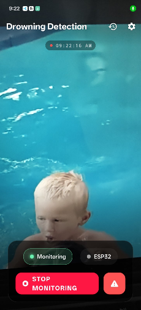

### Automated Emergency Alarm Screen

When the ESP32 confirms a detection and broadcasts its ALARM message, the app immediately takes over the screen with a full-screen "DROWNING DETECTED" alert rendered in high-contrast red. A loud siren plays, the device vibrates, and the screen displays the automatically generated Emergency Clip with a precise timestamp. A buffer timeline lets the user scrub back through the moments leading up to the alert.

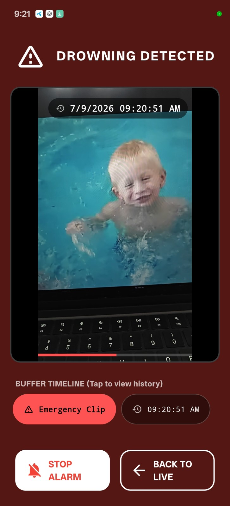

### Incident History

A dedicated Event History tab keeps a permanent, browsable log of every past emergency event, each entry showing an auto-generated thumbnail preview, the event filename (timestamped), and its exact date and time. The user can play back any past clip or delete events that are no longer needed.


### Customizable Settings

The Settings screen lets the user tune the app to their device and environment:
- **Video Quality**: controls camera resolution (e.g. 1080p).
- **ESP32 Connection**: set the receiver IP address (default 192.168.4.1).
- **Alarm Configuration**: toggle for automatic siren playback.
- **Buffer Configuration**: Buffer Size (e.g. 5 minutes) and Segment Duration (e.g. 10 seconds).
- **Clear Video Buffer**: immediately free up memory.

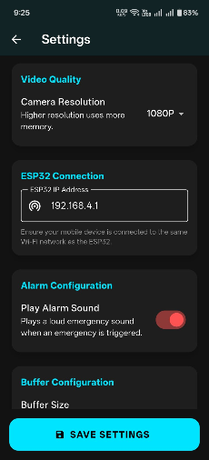

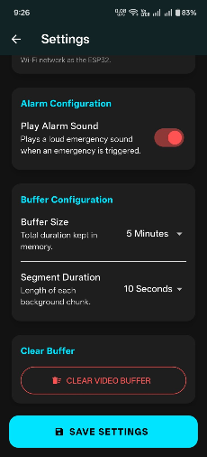

### Flutter Communication

The Flutter application connects to the receiver WebSocket endpoint over the receiver Wi-Fi Access Point. Incoming frames are parsed as JSON and routed based on their type field.

**WebSocket Connection:**

```dart
final channel = WebSocketChannel.connect(
    Uri.parse("ws://192.168.4.1/ws"),
);
channel.stream.listen(
    (message) => handleIncomingMessage(message),
    onError: (e) => setConnectionStatus(false),
    onDone: () => setConnectionStatus(false),
);
```

**Parsing Incoming JSON:**

```dart
void handleIncomingMessage(String message) {
    final data = jsonDecode(message);
    if (data["type"] == "ALARM") {
        triggerEmergencyAlert();
        return;
    }
    setState(() {
        heartRate = data["bpm"];
        waterDetected = data["water"];
        motionLevel = data["motion"];
        isConnected = true;
    });
}
```

**Emergency Alert Handling:**

```dart
void triggerEmergencyAlert() {
    Navigator.pushNamed(context, "/emergency");
    audioPlayer.play(AssetSource("siren.mp3"), volume: 1.0);
    Vibration.vibrate(pattern: [0, 500, 200, 500], repeat: 0);
}
```

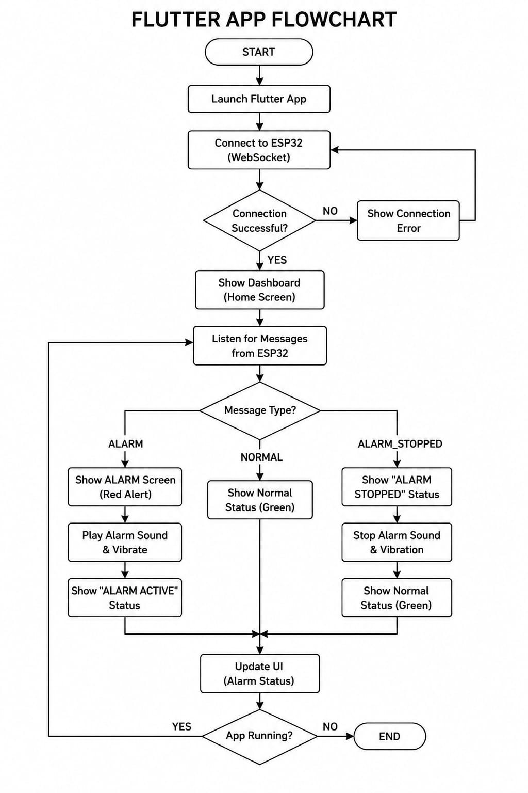

---

## Usage Guide - How to Use

### Hardware Setup

1. **Assemble the analog front-end** on a breadboard following the circuit diagram above.
2. **Connect the piezo hydrophone** to the LM386 input via a 10 uF coupling capacitor.
3. **Power the analog circuit** from a 9V battery (separate from ESP32 power).
4. **Connect the ESP32** to the bias divider output on GPIO32.
5. **Wire the LED** (GPIO2) and buzzer (GPIO25) to their respective GPIO pins.
6. **Flash the firmware** to the ESP32 using Arduino IDE or PlatformIO.
7. **Submerge the hydrophone** in the pool, positioned near the floor.

### Firmware Configuration

Before flashing, adjust these constants in the firmware as needed:

| Constant | Default | Description |
| - | - | - |
| `ssid` | `"test"` | Wi-Fi Access Point name |
| `password` | `"1234567890"` | Wi-Fi password (min 8 characters) |
| `GOERTZEL_THRESHOLD` | `50.0` | Minimum amplitude to consider a detection |
| `SIGNAL_RATIO_THRESHOLD` | `1.3` | Minimum target/reference ratio to reject noise |
| `REQUIRED_HIT_RATIO` | `0.5` | Minimum hit rate in confirmation window (50%) |
| `ALARM_DURATION_MS` | `30000` | Alarm duration in milliseconds (30 seconds) |

### Runtime Serial Commands

These commands can be sent via the Arduino Serial Monitor at 115200 baud:

| Command | Action |
| - | - |
| `alarm` | Manually trigger an alarm |
| `stop` | Stop the current alarm |
| `reset` | Reset the alarm and confirmation window |
| `threshold <value>` | Set the Goertzel amplitude threshold |
| `ratio <value>` | Set the signal ratio threshold |
| `hitratio <value>` | Set the required hit ratio percentage |

### Mobile App Setup

1. **Install the Flutter app** on your phone (build from source or install APK).
2. **Connect your phone** to the ESP32 Wi-Fi network (`test` / `1234567890`).
3. **Open the app** - it will automatically connect to `ws://192.168.4.1/ws`.
4. **Verify connection** - the ESP32 status chip should show "Connected".
5. **Start monitoring** - the app begins watching for alarm signals.
6. **Test the system** - send `alarm` via Serial Monitor to verify the full alert chain.

### WebSocket Protocol

| Message | Direction | Description |
| - | - | - |
| `CONNECTED` | ESP32 -> App | Confirms WebSocket connection |
| `ALARM` | ESP32 -> App | Triggers emergency alert on the app |
| `ALARM_STOPPED` | ESP32 -> App | Confirms alarm has been cleared |
| `STOP_ALARM` | App -> ESP32 | Request to stop the current alarm |

[](diagrams/receiver_with_hydrophone.jpg)

---

## Experimental Results

The receiver subsystem was evaluated in a controlled pool environment to characterise its detection performance and end-to-end alerting latency.

### Hydrophone Sensitivity

Hydrophone sensitivity was verified by generating a 1500 Hz tone underwater at a known source distance and confirming a consistent, clearly distinguishable rise in the amplified signal amplitude at the LM386 output.

### Band-Pass Filter Response

The TL082 band-pass filter response was checked with a signal generator sweep to confirm that its passband was centred close to 1500 Hz and that out-of-band tones were attenuated sufficiently to avoid triggering false detections.

### Goertzel Detection Performance

The Goertzel detector was tested against the filtered signal. The computed magnitude at the target bin was observed to:
- **Rise sharply above the calibrated threshold** whenever the transmitter tone was present
- **Remain below threshold** under quiet and typical ambient pool noise conditions

### False Positive Rejection

The consecutive-detection verification window was tuned experimentally to suppress transient false triggers (for example, from hand claps or splashes near the hydrophone) while keeping detection latency within an acceptable range for a rescue-alert application.

### End-to-End Alert Latency

On confirmed detection, the local LED and buzzer activated immediately, and the corresponding JSON ALARM frame was observed to arrive at the connected Flutter client with negligible additional delay, after which the application transitioned to the emergency alert screen with siren and vibration active.


---

## Advantages

- Acoustic detection remains **reliable underwater** where RF-based approaches such as NRF24L01 fail due to severe signal attenuation in water.
- The Goertzel algorithm provides **efficient, real-time single-tone detection** with minimal computational and memory overhead on the ESP32.
- Consecutive-detection verification **substantially reduces false alarms** from ambient pool noise.
- A self-hosted Wi-Fi Access Point and WebSocket server **remove any dependency on existing network infrastructure** at the deployment site.
- The Flutter application provides **immediate, high-visibility alerting** through simultaneous visual, audible, and vibratory notification.
- The overall **hardware cost is low**, relying on commonly available components such as the LM386, TL082, and a DIY piezo hydrophone.

---

## Limitations

- Detection range is limited by **hydrophone sensitivity and acoustic attenuation** over distance, requiring careful placement within the pool.
- A single fixed-frequency detector **cannot distinguish between multiple simultaneous transmitters** in a multi-swimmer deployment without frequency or time-division extensions.
- The self-hosted Access Point **restricts the mobile application to a single local network**, limiting simultaneous connections and remote monitoring.
- Ambient acoustic noise sources with strong energy near 1500 Hz could, in principle, **still trigger false detections** despite threshold and confirmation-window safeguards.
- The analog front end requires **careful manual calibration** (gain, filter tuning, bias points) during assembly, which limits ease of replication.

---

## Conclusion

This project has presented the design, implementation, and evaluation of a hydrophone receiver and Flutter mobile application that together complete the drowning detection and rescue alert system. By combining a purpose-built analog front end, an efficient Goertzel-based detection algorithm, and a responsive mobile interface, the receiver subsystem reliably converts an underwater acoustic distress signal into a timely, high-visibility alert.

Experimental testing confirmed that the system detects the 1500 Hz transmitter tone consistently while rejecting typical ambient pool noise, and delivers the resulting alarm to the caregiver phone with minimal latency, validating the acoustic-first design approach adopted to overcome the limitations of underwater RF communication.

---

## Author

**Dadhichi Sarker Shayon**


---

## Wearable Acoustic Transmitter

The wearable transmitter is the swimmer-side unit of the drowning detection system. It continuously monitors three physiological and environmental indicators — **heart rate**, **water submersion**, and **body motion** — and, upon confirming an emergency condition, drives a submerged piezo transducer to emit a **1500 Hz acoustic distress tone** that the poolside hydrophone receiver can detect.

[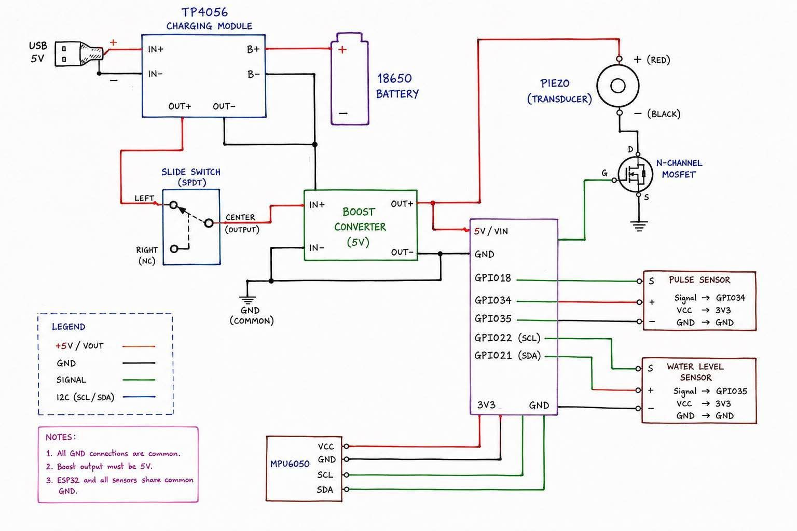](diagrams/circuit_diagram_of_transmitter.jpeg)

---

## Transmitter Hardware Components

### Complete Component List

| # | Component | Specification | Quantity | Function |
| - | --- | --- | - | --- |
| 1 | ESP32 DevKit V1 | Dual-core, Wi-Fi + BLE, 12-bit ADC | 1 | Sensor fusion, emergency logic, MOSFET drive |
| 2 | Pulse Sensor | Analog photoplethysmography (PPG) | 1 | Heart rate (BPM) measurement |
| 3 | Water Level Sensor | Analog resistive | 1 | Submersion / water-contact detection |
| 4 | MPU-6050 | 3-axis accelerometer + gyroscope, I2C | 1 | Body motion monitoring |
| 5 | Piezo Transducer | Waterproofed buzzer / disc | 1 | Underwater 1500 Hz acoustic tone emission |
| 6 | N-Channel MOSFET | Logic-level gate (e.g. IRLZ44N or 2N7000) | 1 | Switches piezo transducer from ESP32 GPIO |
| 7 | 18650 Li-Ion Battery | 3.7 V, ≥ 2000 mAh | 1 | Main power source |
| 8 | TP4056 Charging Module | USB 5V input, Li-Ion charger with protection | 1 | Safe battery charging via USB |
| 9 | Boost Converter (5V) | MT3608 or equivalent, output set to 5V | 1 | Steps up 3.7 V battery to stable 5 V rail |
| 10 | SPDT Slide Switch | Panel-mount | 1 | Power on/off control |
| 11 | Resistors | 220 Ω gate resistor for MOSFET | 1 | Limits gate drive current |
| 12 | Breadboard + Jumper Wires | Standard | 1 set | Circuit prototyping |

### Detailed Component Overview

#### ESP32 DevKit V1
The brain of the transmitter. Running at 240 MHz, it continuously reads the pulse sensor and water sensor via its 12-bit ADC, polls the MPU-6050 over I2C, evaluates the multi-factor emergency logic, and drives the MOSFET gate (GPIO18) with a 1500 Hz `tone()` signal when an emergency is confirmed. Key pins used:

- **GPIO34** – Pulse sensor analog input (ADC-only pin)
- **GPIO35** – Water level sensor analog input (ADC-only pin)
- **GPIO18** – MOSFET gate drive (PWM / tone output)
- **GPIO21 / GPIO22** – I2C SDA / SCL for MPU-6050
- **GPIO12** – Main data switch / enable input

#### Pulse Sensor (PPG)
An analog photoplethysmography sensor worn on the finger or wrist. It produces a pulsing analog waveform synchronized with the heartbeat. The ESP32 detects each peak above a configurable `PULSE_THRESHOLD` (default 2200 out of 4095) and computes a rolling average BPM over five consecutive beats. The BPM value feeds directly into the abnormal heart rate emergency conditions.

#### Water Level Sensor
A resistive water-contact sensor that outputs a rising analog voltage when immersed. Any reading above 50 (out of 4095) is treated as active submersion, and the firmware begins timing the continuous submersion duration. This duration feeds into both the 5-minute multi-factor condition and the absolute 10-second submersion limit.

#### MPU-6050 Accelerometer / Gyroscope
A 6-DoF inertial measurement unit connected over I2C (SDA = GPIO21, SCL = GPIO22). The firmware reads the three raw accelerometer axes every 100 ms and counts axis-delta events that exceed `MOTION_THRESHOLD` (5000 LSB). The accumulated spike count within a rolling 10-second window captures the erratic, high-frequency motion pattern characteristic of a drowning struggle.

#### N-Channel MOSFET
A logic-level N-channel MOSFET switches the piezo transducer load. The ESP32 GPIO18 drives the gate through a small series resistor (≈ 220 Ω) to limit switching transients. When the gate is driven HIGH by the `tone()` function at 1500 Hz, the MOSFET rapidly switches the piezo between the 5 V rail and ground, generating a 1500 Hz acoustic tone. The source is tied to common GND; the drain connects to the piezo negative terminal; the piezo positive terminal connects to 5 V.

#### TP4056 + Boost Converter Power Path
The 18650 cell charges safely through the TP4056 module (USB 5V input). The cell output feeds a boost converter set to 5.0 V, which powers the ESP32 VIN pin and the piezo drive rail. A SPDT slide switch in the boost converter input line provides physical power control. All GND connections — battery, boost, ESP32, sensors — share a common ground node.

---

## Transmitter Circuit Design and Connections


### Complete Signal Chain

```
[18650 Battery] --> [TP4056 Charger] --> [SPDT Switch] --> [Boost Converter (5V)]
                                                                     |
                                              +----------------------+----------------------+
                                              |                      |                      |
                                         [ESP32 VIN]          [MOSFET Drain (via Piezo)]  [Sensors VCC]
                                              |
                              +--------------+--------------+
                              |              |              |
                        [GPIO34: Pulse] [GPIO35: Water] [GPIO21/22: MPU-6050 I2C]
                              |
                         [GPIO18: MOSFET Gate] --> [N-CH MOSFET] --> [Piezo Transducer] --> [5V Rail]
```

### Stage-by-Stage Wiring

#### Stage 1: Power Supply

```
USB 5V --> TP4056 (IN+ / IN-)
TP4056 (B+ / B-) <----> 18650 Battery
TP4056 (OUT+ / OUT-) --> SPDT Switch (CENTER)

SPDT Switch (LEFT) --> Boost Converter (IN+)
GND (common) -------> Boost Converter (IN-)

Boost Converter (OUT+) --> ESP32 VIN  (5V rail)
                       --> Piezo (+) RED wire
Boost Converter (OUT-) --> GND (common)

NOTE: Set boost converter output to exactly 5.0 V before connecting.
```

#### Stage 2: Pulse Sensor

```
Pulse Sensor:
  VCC    ----> 3.3V (ESP32 3V3 pin)
  GND    ----> GND (common)
  Signal ----> ESP32 GPIO34 (ADC input)

NOTE: GPIO34 is an input-only ADC pin on ESP32 – do not use for output.
```

#### Stage 3: Water Level Sensor

```
Water Level Sensor:
  VCC    ----> 3.3V (ESP32 3V3 pin)
  GND    ----> GND (common)
  Signal ----> ESP32 GPIO35 (ADC input)

NOTE: GPIO35 is an input-only ADC pin on ESP32 – do not use for output.
```

#### Stage 4: MPU-6050 IMU (I2C)

```
MPU-6050:
  VCC ----> 3.3V (ESP32 3V3 pin)
  GND ----> GND (common)
  SCL ----> ESP32 GPIO22
  SDA ----> ESP32 GPIO21
  AD0 ----> GND  (sets I2C address to 0x68)
  INT ----> Not connected (polling mode)
```

#### Stage 5: MOSFET and Piezo Transducer

```
N-Channel MOSFET:
  Gate (G)  ---[220Ω]--- ESP32 GPIO18 (tone output)
  Source (S) ----------- GND (common)
  Drain (D)  ----------- Piezo Transducer (-) BLACK wire

Piezo Transducer:
  (+) RED  ----> Boost Converter OUT+ (5V rail)
  (-) BLACK ---> MOSFET Drain

Operation: GPIO18 drives 1500 Hz square wave via tone().
           MOSFET switches piezo between 5V and GND at 1500 Hz,
           generating the underwater acoustic distress tone.
```

#### Stage 6: Data Switch

```
ESP32 GPIO12 ----> SPDT Switch signal leg (or dedicated enable switch)
                   (pulled up internally; LOW = data mode disabled)
```

### Pin Reference Table

| ESP32 Pin | Connected To | Direction | Notes |
| - | - | - | - |
| GPIO34 | Pulse sensor signal | Input (ADC) | ADC-only pin; 0–3.3V |
| GPIO35 | Water level sensor signal | Input (ADC) | ADC-only pin; 0–3.3V |
| GPIO18 | MOSFET gate (piezo drive) | Output (PWM/tone) | 1500 Hz square wave via `tone()` |
| GPIO21 | MPU-6050 SDA | I2C Data | 3.3V logic |
| GPIO22 | MPU-6050 SCL | I2C Clock | 3.3V logic |
| GPIO12 | Data switch | Input | `INPUT_PULLUP`; LOW = inactive |
| 3V3 | Pulse sensor VCC, Water sensor VCC, MPU-6050 VCC | Power | 3.3V regulated output |
| GND | All sensor GNDs, MOSFET source, boost GND | Power | Common ground |
| VIN | Boost converter OUT+ (5V) | Power | Powers ESP32 via onboard LDO |

[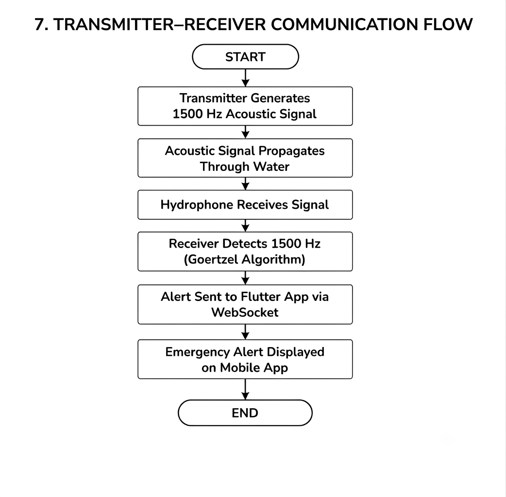](diagrams/transmitter_receiver_communication_flowchart.png)

---

## How It Works - Transmitter Working Principle

### Step-by-Step Detection Process

**Step 1: Continuous Sensor Polling**
The transmitter polls all three sensors in a tight main loop (10 ms delay):
- **Pulse sensor** is sampled on every iteration; peak detection computes inter-beat intervals and accumulates a rolling 5-beat average BPM.
- **Water sensor** is read each iteration; any reading above 50 starts (or continues) a submersion timer.
- **MPU-6050** accelerometer axes are read every 100 ms; large axis deltas (> 5000 LSB) increment a spike counter that resets every 10 seconds.

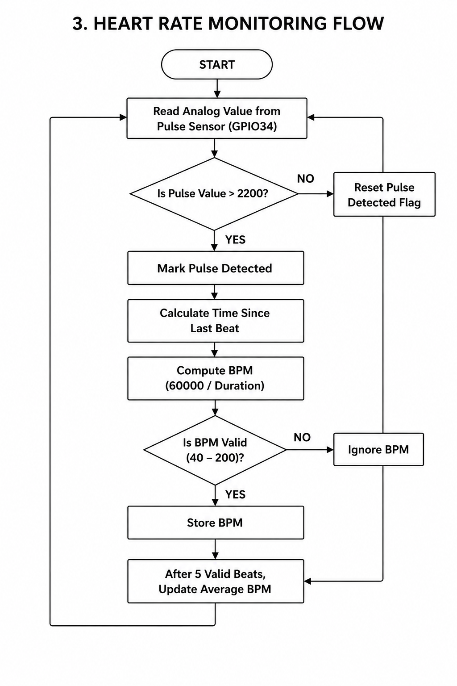

**Step 2: Multi-Factor Emergency Evaluation**
Each main loop iteration evaluates four independent emergency conditions in priority order:

| Priority | Condition | Trigger Criteria |
| - | - | - |
| 1 | **3-Factor Critical** | Submerged > 5 min **AND** abnormal BPM **AND** > 15 motion spikes |
| 2 | **Bradycardia** | Average BPM < 70 (and > 50, confirming a valid reading) |
| 3 | **Tachycardia** | Average BPM > 130 |
| 4 | **Absolute Submersion** | Continuously submerged for > 10 seconds |

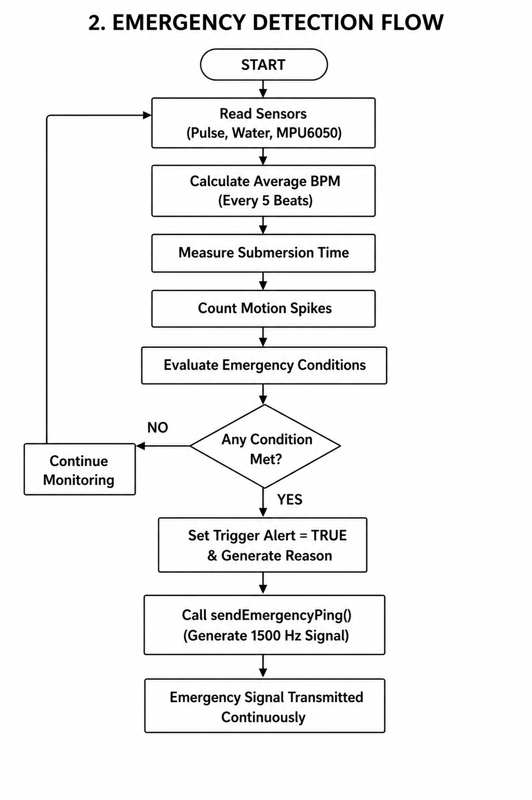

**Step 3: Acoustic Distress Tone Emission**
When any emergency condition is met, `sendEmergencyPing()` is called. This function enters an infinite loop that:
1. Calls `tone(MOSFET_GATE_PIN, 1500)` — drives GPIO18 with a 1500 Hz PWM signal
2. Holds the tone for **150 ms**
3. Calls `noTone(MOSFET_GATE_PIN)` — gate goes LOW, MOSFET off, piezo silent
4. Waits **100 ms** (silence gap)
5. Repeats indefinitely until the device is powered off or reset

This pulsed pattern (150 ms on / 100 ms off) gives the receiver's Goertzel confirmation window enough consistent tone blocks to achieve the required hit ratio while also being distinguishable from continuous ambient noise.

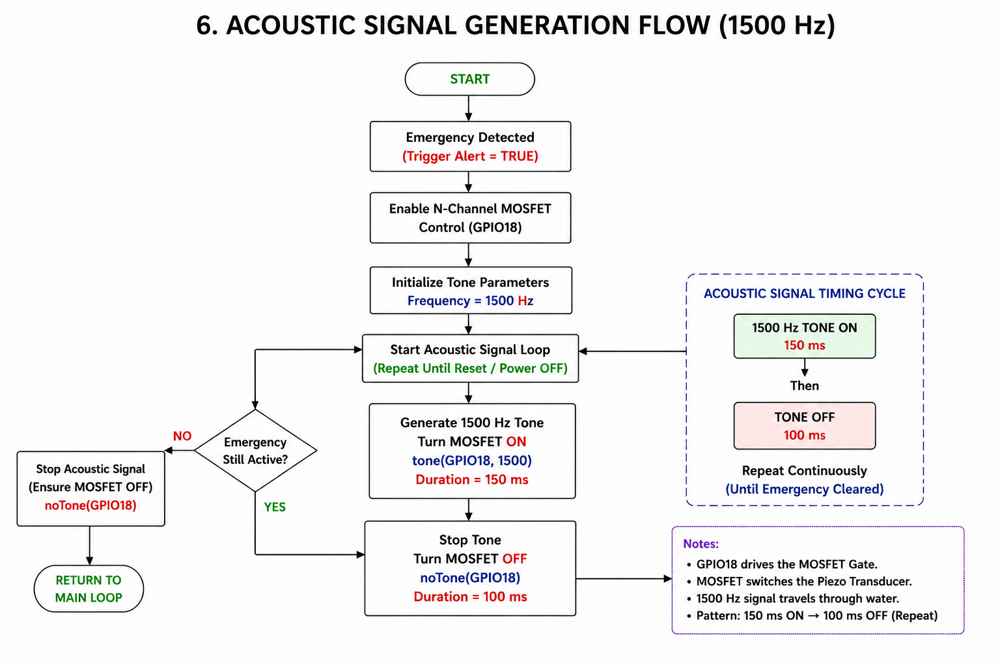

**Step 4: Hydrophone Receiver Detection**
The 1500 Hz acoustic tone propagates through the water to the poolside hydrophone. The receiver station's Goertzel algorithm detects the tone, verifies it against the confirmation window, and triggers the local alarm and Flutter mobile app alert — completing the end-to-end rescue notification chain.


### Detection Logic Flow

```
[START] --> [Read Pulse Sensor] --> [Compute BPM (rolling 5-beat avg)]
                |
                v
         [Read Water Sensor] --> [Start/Update submersion timer]
                |
                v
       [Read MPU-6050 Accel] --> [Count motion spikes (100ms window)]
                |
                v
     +----------+----------+----------+----------+
     |                     |          |          |
[3-Factor?]          [BPM<70?]  [BPM>130?]  [Submerged>10s?]
 (Water>5m +              |          |          |
  HeartAbn +              |          |          |
  Motion>15)              +----------+----------+
     |                              |
    YES                            YES
     |                              |
     +----------+---------+---------+
                          |
                  [sendEmergencyPing()]
                          |
                 [tone(GPIO18, 1500Hz)]
                   150ms ON / 100ms OFF
                          |
                  [Hydrophone detects tone]
                          |
                  [Receiver raises ALARM]
                          |
                  [Flutter App Alert]
```

### Sensor Sub-System Flowcharts


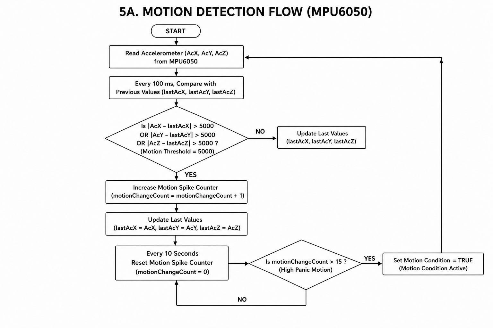

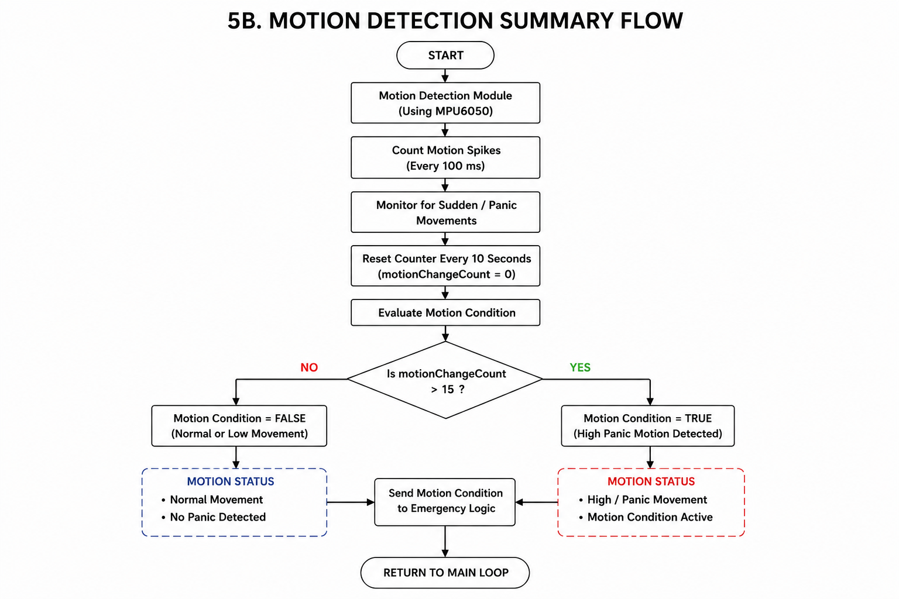

---

## Transmitter Software Design

The transmitter firmware is developed in **C++ using the Arduino framework** for ESP32.

### Heart Rate (BPM) Measurement

```c
const int PULSE_THRESHOLD = 2200;    // ADC threshold for peak detection
const float HEART_LOW  = 70.0;       // BPM: bradycardia threshold
const float HEART_HIGH = 130.0;      // BPM: tachycardia threshold

int analogPulse = analogRead(PULSE_PIN);   // GPIO34

// Rising-edge peak detection
if (analogPulse > PULSE_THRESHOLD && !pulseDetected) {
    pulseDetected = true;
    unsigned long currentBeatTime = millis();
    if (lastBeatTime > 0) {
        unsigned long interval = currentBeatTime - lastBeatTime;
        float bpm = 60000.0 / interval;
        if (bpm >= 40 && bpm <= 200) {
            totalBPM += bpm;
            beatCounter++;
            if (beatCounter >= 5) {          // average over 5 beats
                averageBPM = totalBPM / 5;
                totalBPM = 0;
                beatCounter = 0;
            }
        }
    }
    lastBeatTime = currentBeatTime;
}
if (analogPulse < (PULSE_THRESHOLD - 100)) pulseDetected = false;
```

### Water Submersion Monitoring

```c
int waterValue = analogRead(WATER_PIN);   // GPIO35

if (waterValue > 50) {
    if (!isDrowned) {
        isDrowned = true;
        drownStartTime = millis();        // start submersion timer
    }
    totalDrownDuration = (millis() - drownStartTime) / 1000;  // seconds
} else {
    isDrowned = false;
    totalDrownDuration = 0;              // reset on surfacing
}
```

### Motion Spike Detection (MPU-6050)

```c
const int MOTION_THRESHOLD = 5000;      // accelerometer LSB delta
const int MPU_addr = 0x68;

// Read raw accelerometer axes every 100 ms
if (millis() - lastMotionCheck > 100) {
    lastMotionCheck = millis();
    Wire.beginTransmission(MPU_addr);
    Wire.write(0x3B);
    Wire.endTransmission(false);
    Wire.requestFrom(MPU_addr, 6, true);
    AcX = Wire.read() << 8 | Wire.read();
    AcY = Wire.read() << 8 | Wire.read();
    AcZ = Wire.read() << 8 | Wire.read();

    if (abs(AcX - lastAcX) > MOTION_THRESHOLD ||
        abs(AcY - lastAcY) > MOTION_THRESHOLD ||
        abs(AcZ - lastAcZ) > MOTION_THRESHOLD) {
        motionChangeCount++;
    }
    lastAcX = AcX; lastAcY = AcY; lastAcZ = AcZ;
}

// Reset spike counter every 10 seconds
if (millis() - lastMotionReset > 10000) {
    lastMotionReset = millis();
    motionChangeCount = 0;
}
```

### Multi-Factor Emergency Logic

```c
const unsigned long MAX_SUBMERGED_3_FACTOR  = 300000;  // 5 min (ms)
const unsigned long MAX_ABSOLUTE_SUBMERGED  = 10000;   // 10 s  (ms)

bool point1_Water  = isDrowned && (millis() - drownStartTime >= MAX_SUBMERGED_3_FACTOR);
bool point2_Heart  = (averageBPM > 120) || (averageBPM < 60 && averageBPM > 0);
bool point3_Motion = (motionChangeCount > 15);

bool triggerAlert = false;

// Condition 1: All three factors simultaneously
if (point1_Water && point2_Heart && point3_Motion) {
    triggerAlert = true;
}
// Condition 2: Bradycardia
else if (averageBPM < HEART_LOW && averageBPM > 50) {
    triggerAlert = true;
}
// Condition 3: Tachycardia
else if (averageBPM > HEART_HIGH) {
    triggerAlert = true;
}
// Condition 4: Absolute submersion time exceeded
else if (isDrowned && (millis() - drownStartTime >= MAX_ABSOLUTE_SUBMERGED)) {
    triggerAlert = true;
}

if (triggerAlert) sendEmergencyPing();
```

### Acoustic Tone Emission

```c
const int MOSFET_GATE_PIN = 18;    // GPIO18 drives MOSFET gate

void sendEmergencyPing() {
    // Infinite loop: device stays in alarm state until reset
    while (true) {
        tone(MOSFET_GATE_PIN, 1500);   // 1500 Hz PWM to MOSFET gate
        delay(150);                     // tone ON for 150 ms
        noTone(MOSFET_GATE_PIN);        // gate LOW, piezo silent
        delay(100);                     // silence for 100 ms
    }
}
```

The `tone()` function generates a 50% duty-cycle square wave at 1500 Hz on GPIO18. The MOSFET switches the piezo transducer at this frequency, converting the electrical signal into an underwater acoustic pressure wave at exactly the frequency the receiver's Goertzel detector is tuned to.


### Complete Transmitter Firmware Source

The full working ESP32 transmitter firmware is included below. This is the complete, tested source code:

```c
#include <Wire.h>

#define PULSE_PIN 34          // Pulse sensor Analog Pin
#define WATER_PIN 35          // Water sensor Analog Pin
#define MOSFET_GATE_PIN 18    // MOSFET gate pin (piezo drive)
#define DATA_SWITCH_PIN 12    // Main enable switch

const int MPU_addr = 0x68;   // MPU-6050 I2C address

const int PULSE_THRESHOLD = 2200;
const float HEART_LOW = 70.0;
const float HEART_HIGH = 130.0;
const unsigned long MAX_SUBMERGED_3_FACTOR = 300000; // 5 min
const unsigned long MAX_ABSOLUTE_SUBMERGED = 10000;  // 10 s
const int MOTION_THRESHOLD = 5000;

int16_t AcX, AcY, AcZ, Tmp, GyX, GyY, GyZ;
int16_t lastAcX = 0, lastAcY = 0, lastAcZ = 0;

unsigned long lastBeatTime = 0;
int beatCounter = 0;
float totalBPM = 0;
float averageBPM = 0;
bool pulseDetected = false;

bool isDrowned = false;
unsigned long drownStartTime = 0;
unsigned long totalDrownDuration = 0;

unsigned long lastMotionCheck = 0;
unsigned long motionChangeCount = 0;

void sendEmergencyPing();

void setup() {
  Serial.begin(115200);
  Wire.begin(21, 22); // SDA = GPIO21, SCL = GPIO22

  pinMode(MOSFET_GATE_PIN, OUTPUT);
  pinMode(DATA_SWITCH_PIN, INPUT_PULLUP);
  digitalWrite(MOSFET_GATE_PIN, LOW);

  // Wake MPU-6050 from sleep
  Wire.beginTransmission(MPU_addr);
  Wire.write(0x6B);
  Wire.write(0);
  Wire.endTransmission(true);

  Serial.println("Transmitter Initialized");
}

void loop() {
  unsigned long currentMillis = millis();

  // --- Heart Rate ---
  int analogPulse = analogRead(PULSE_PIN);
  if (analogPulse > PULSE_THRESHOLD && !pulseDetected) {
    pulseDetected = true;
    if (lastBeatTime > 0) {
      float bpm = 60000.0 / (currentMillis - lastBeatTime);
      if (bpm >= 40 && bpm <= 200) {
        totalBPM += bpm;
        beatCounter++;
        if (beatCounter >= 5) {
          averageBPM = totalBPM / 5;
          totalBPM = 0;
          beatCounter = 0;
        }
      }
    }
    lastBeatTime = currentMillis;
  }
  if (analogPulse < (PULSE_THRESHOLD - 100)) pulseDetected = false;

  // --- Water Submersion ---
  int waterValue = analogRead(WATER_PIN);
  if (waterValue > 50) {
    if (!isDrowned) { isDrowned = true; drownStartTime = currentMillis; }
    totalDrownDuration = (currentMillis - drownStartTime) / 1000;
  } else {
    isDrowned = false;
    totalDrownDuration = 0;
  }

  // --- Motion Detection ---
  Wire.beginTransmission(MPU_addr);
  Wire.write(0x3B);
  Wire.endTransmission(false);
  Wire.requestFrom(MPU_addr, 6, true);
  AcX = Wire.read() << 8 | Wire.read();
  AcY = Wire.read() << 8 | Wire.read();
  AcZ = Wire.read() << 8 | Wire.read();

  if (currentMillis - lastMotionCheck > 100) {
    lastMotionCheck = currentMillis;
    if (abs(AcX - lastAcX) > MOTION_THRESHOLD ||
        abs(AcY - lastAcY) > MOTION_THRESHOLD ||
        abs(AcZ - lastAcZ) > MOTION_THRESHOLD) {
      motionChangeCount++;
    }
    lastAcX = AcX; lastAcY = AcY; lastAcZ = AcZ;
  }

  // --- Emergency Condition Evaluation ---
  bool point1_Water  = isDrowned && (currentMillis - drownStartTime >= MAX_SUBMERGED_3_FACTOR);
  bool point2_Heart  = (averageBPM > 120) || (averageBPM < 60 && averageBPM > 0);
  bool point3_Motion = (motionChangeCount > 15);

  static unsigned long lastMotionReset = 0;
  if (currentMillis - lastMotionReset > 10000) {
    lastMotionReset = currentMillis;
    motionChangeCount = 0;
  }

  bool triggerAlert = false;
  String reason = "";

  if (point1_Water && point2_Heart && point3_Motion) {
    triggerAlert = true;
    reason = "3-Factor Critical: Submerged > 5m + Abnormal BPM + Panic Motion";
  } else if (averageBPM < HEART_LOW && averageBPM > 50) {
    triggerAlert = true;
    reason = "CRITICAL: Heart Rate Below 70 BPM (Bradycardia)";
  } else if (averageBPM > HEART_HIGH) {
    triggerAlert = true;
    reason = "CRITICAL: Heart Rate Exceeded 130 BPM (Tachycardia)";
  } else if (isDrowned && (currentMillis - drownStartTime >= MAX_ABSOLUTE_SUBMERGED)) {
    triggerAlert = true;
    reason = "CRITICAL: Absolute Submersion Time (10s) Exceeded";
  }

  if (triggerAlert) {
    Serial.println("\nEMERGENCY DETECTED");
    Serial.print("Reason: "); Serial.println(reason);
    sendEmergencyPing();
  }

  // --- Periodic Status Log ---
  static unsigned long lastLog = 0;
  if (currentMillis - lastLog > 2000) {
    lastLog = currentMillis;
    Serial.print("\nBPM: "); Serial.print(averageBPM, 1);
    Serial.print(" | Submerged: "); Serial.print(totalDrownDuration); Serial.print("s");
    Serial.print(" | Motion Spikes: "); Serial.println(motionChangeCount);
  }

  delay(10);
}

void sendEmergencyPing() {
  while (true) {
    tone(MOSFET_GATE_PIN, 1500);   // 1500 Hz tone ON
    delay(150);
    noTone(MOSFET_GATE_PIN);       // Tone OFF
    delay(100);
  }
}
```

---

## Transmitter Usage Guide

### Hardware Assembly

1. **Assemble the power path**: Connect the 18650 battery to the TP4056 module (B+/B−). Connect TP4056 OUT+ through the SPDT slide switch to the boost converter IN+. Set the boost converter output to **5.0 V** before connecting any load.
2. **Connect sensors**: Wire the pulse sensor and water level sensor signal lines to GPIO34 and GPIO35 respectively; share 3.3V and GND from the ESP32.
3. **Connect the MPU-6050**: SDA → GPIO21, SCL → GPIO22, VCC → 3.3V, GND → common GND, AD0 → GND.
4. **Wire the MOSFET and piezo**: Gate → GPIO18 (via 220 Ω), Source → GND, Drain → piezo (−) BLACK wire. Piezo (+) RED wire → boost converter OUT+ (5V).
5. **Power the ESP32**: Boost converter OUT+ → ESP32 VIN pin.
6. **Flash the firmware** using Arduino IDE or PlatformIO.
7. **Waterproof the piezo transducer** with silicone or epoxy, leaving only the active face exposed, and position it on the swimmer's body or on a wrist band pointed toward the pool floor.

### Firmware Configuration

Before flashing, adjust these constants in the firmware as needed:

| Constant | Default | Description |
| - | - | - |
| `PULSE_THRESHOLD` | `2200` | ADC peak-detection threshold (0–4095 scale) |
| `HEART_LOW` | `70.0` | BPM lower bound for bradycardia alert |
| `HEART_HIGH` | `130.0` | BPM upper bound for tachycardia alert |
| `MAX_SUBMERGED_3_FACTOR` | `300000` | Submersion time for 3-factor trigger (ms, default 5 min) |
| `MAX_ABSOLUTE_SUBMERGED` | `10000` | Submersion time for absolute trigger (ms, default 10 s) |
| `MOTION_THRESHOLD` | `5000` | Accelerometer delta (LSB) for a motion spike |

### Serial Monitor Output

Connect at **115200 baud** to observe live telemetry:

```
Transmitter Initialized

BPM: 72.4 | Submerged: 0s | Motion Spikes: 2
BPM: 73.1 | Submerged: 3s | Motion Spikes: 4
BPM: 145.0 | Submerged: 5s | Motion Spikes: 18

EMERGENCY DETECTED
Reason: CRITICAL: Heart Rate Exceeded 130 BPM (Tachycardia)
```

### Transmitter–Receiver WebSocket Protocol

Once the emergency tone is emitted and the hydrophone receiver detects it, the receiver manages the full WebSocket communication with the Flutter app. The transmitter itself does not connect to Wi-Fi; the acoustic channel **is** the communication link between transmitter and receiver.

| Link | Medium | Message |
| - | - | - |
| Transmitter → Receiver | 1500 Hz acoustic tone (underwater) | Distress signal |
| Receiver → Flutter App | WebSocket JSON over Wi-Fi | `"ALARM"` / `"ALARM_STOPPED"` |
| Flutter App → Receiver | WebSocket text over Wi-Fi | `"STOP_ALARM"` |

[](diagrams/transmitter_receiver_communication_flowchart.png)

---

